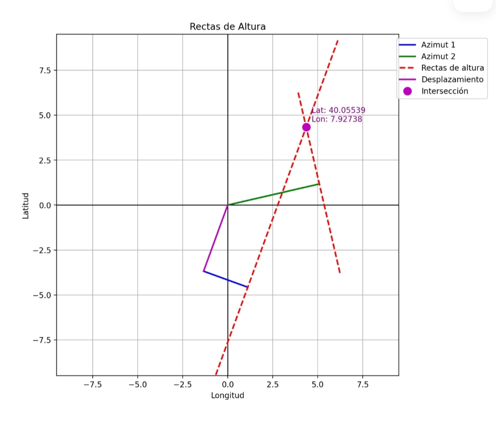

# Rectas de altura. Calculadora Náutica en Python



**Resuelve ejercicios reales de los exámenes de Patrón de Yate y navegación astronómica sin GPS. Con cálculo analítico + solución gráfica.**

---

## Qué es esta herramienta

**Posicionamiento** es una aplicación web escrita en **Python** usando la librería **Streamlit** que te permite resolver, de manera rápida y visual, ejercicios de **posicionamiento por rectas de altura** con observación a dos astros.

Está diseñada especialmente para:

- **Estudiantes de náutica deportiva** (Patrón de Yate, Capitán de Yate)
- **Navegantes profesionales** (Marina Mercante, titulaciones STCW)
- **Marinos curiosos o aventureros** que quieran aprender a posicionarse **sin GPS**

---

## Funcionalidades

- Ingreso intuitivo de datos astronómicos (latitud estimada, azimut, diferencia de alturas, etc.)
- Gráficos interactivos de las rectas de altura y vectores implicados
- Cálculo automático de la **posición observada** tras la doble observación
- Solución tanto **numérica** como **visual**, ideal para comprender el razonamiento
- Interfaz web moderna con Streamlit: corre en el navegador sin instalar nada complicado

---

## ¿Por qué usarla?

> "¿Y si se apaga el GPS en medio del océano?"

Esta herramienta simula exactamente esa situación y te permite:
- **Entrenar** para exámenes reales de navegación astronómica
- **Ver gráficamente** cómo se intersectan las rectas de altura
- **Comparar tu solución manual** con la solución del programa
- **Resolver ejercicios reales** con una herramienta moderna, visual y didáctica

---

## Capturas de pantalla

  
*Pantalla de ingreso de datos*

  
*Resolución final con gráfico de intersección de rectas*

---

## Cómo usar

1. Clona el repositorio:

```bash
git clone https://github.com/nauticaweb/Posicionamiento.git
cd Posicionamiento
```

2. Instala las dependencias:

```bash
pip install -r requirements.txt
```

3. Ejecuta la aplicación:

```bash
streamlit run app.py
```

¡Y listo! Se abrirá automáticamente en tu navegador.

---

## Enlace directo a la versión online

**[Accede a la aplicación web aquí](https://rectasaltura.streamlit.app/)**

*(No necesitas instalar nada, solo entrar desde el navegador)*

---

## Autor

Desarrollado por **Javier Hernández**, apasionado por la náutica, la educación y la tecnología.

---

## Licencia

MIT — Eres libre de usar, mejorar y compartir este proyecto.

---

> **¿Te resultó útil?** No olvides dejar una estrella en GitHub o compartirlo con tus compañeros de navegación.